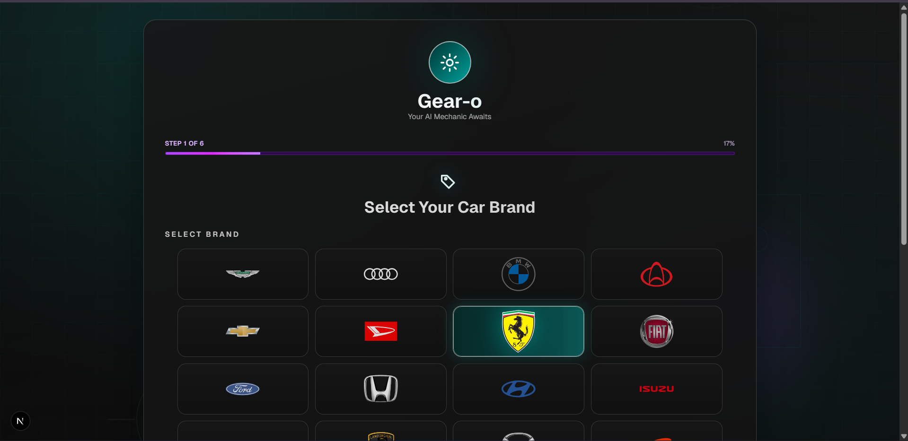
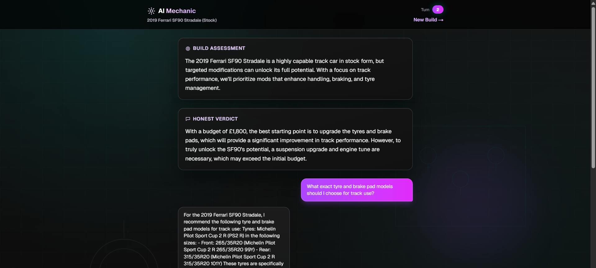
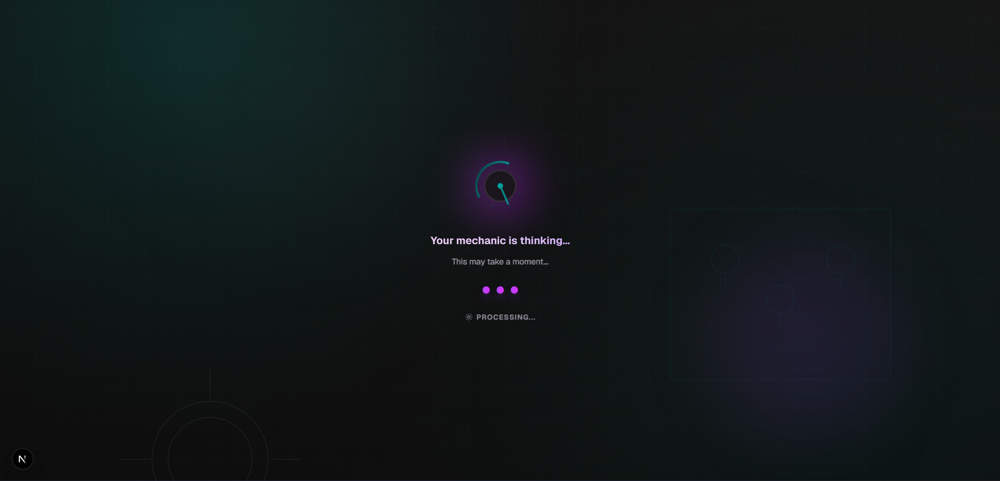

# Gear-o

Gear-o is an AI-assisted car build advisor. You describe your car, goals, and budget, and the app returns practical upgrade suggestions, staged budget planning, and follow-up chat guidance.
### Garage / Onboarding


### AI Chat / Build Output

## Tech Stack

- Frontend: Next.js, React, TypeScript, Tailwind CSS
- Backend: Python (FastAPI)
- Dev setup: Local frontend + backend services (optional Docker workflow)

## Project Structure

```text
Gear-o/
	backend/
		app/
		tests/
	frontend/
		src/
	docker-compose.yml
```

## Getting Started

## 1. Backend

From the project root:

```powershell
cd backend
python -m venv .venv
.\.venv\Scripts\activate
pip install -r requirements.txt
uvicorn app.main:app --reload --host 0.0.0.0 --port 8000
```

Backend should be available at `http://localhost:8000`.

## 2. Frontend

Open a new terminal and run:

```powershell
cd frontend
npm install
npm run dev
```

Frontend should be available at `http://localhost:3000`.
